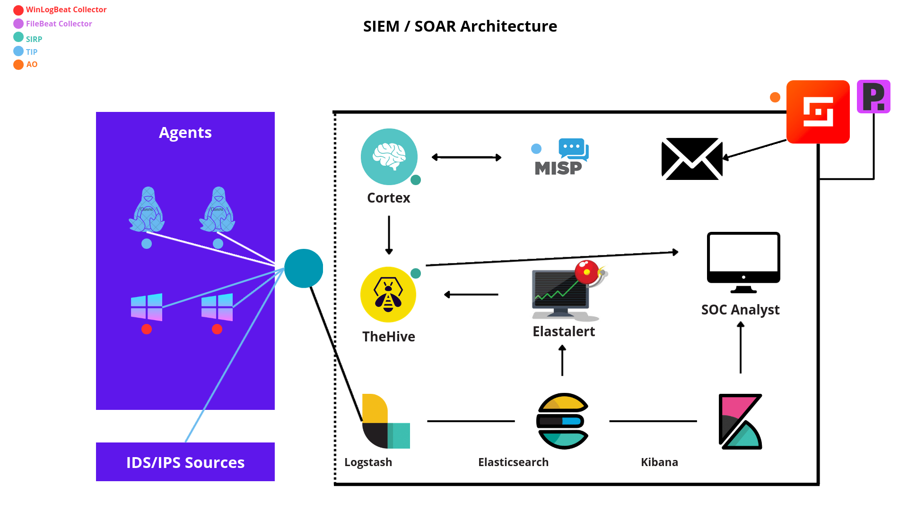

# ELK + SOC Stack Deployment and Operational Guide

This document describes the architecture, services, default credentials (development), configuration locations, automated scripts, operational commands, and troubleshooting notes for the SOC stack in this repository.

---

## Table of contents

- [Architecture overview](#architecture-overview)
- [Network plan and static IPs](#network-plan-and-static-ips)
- [Services and purpose (summary table)](#services-and-purpose-summary-table)
- [Default credentials (development ONLY)](#default-credentials-development-only)
- [Per-service detailed notes](#per-service-detailed-notes)
  - [Elasticsearch](#elasticsearch)
  - [Cortex](#cortex)
  - [TheHive](#thehive)
  - [MISP](#misp)
  - [Cassandra](#cassandra)
  - [MySQL (MISP)](#mysql-misp)
  - [Redis](#redis)
  - [MinIO](#minio)
  - [MISP Modules](#misp-modules)
- [Configuration file locations](#configuration-file-locations)
- [Docker Compose: layout, volumes, startup](#docker-compose-layout-volumes-startup)
- [Automated scripts: usage and details](#automated-scripts-usage-and-details)
- [Start / Stop / Logs / Health checks](#start--stop--logs--health-checks)
- [Troubleshooting by service (common errors and fixes)](#troubleshooting-by-service-common-errors-and-fixes)
- [Backups and recovery](#backups-and-recovery)
- [Security hardening checklist (development → production)](#security-hardening-checklist-development--production)
- [Upgrades and redeploy steps](#upgrades-and-redeploy-steps)
- [Maintenance and housekeeping](#maintenance-and-housekeeping)
- [Appendix: useful commands and examples](#appendix-useful-commands-and-examples)

---

## Architecture overview

- Deployment model: Docker Compose on a single host or VM.
- Purpose: SOC/lab environment combining TheHive, Cortex as SIRP , MISP (threat sharing) as TIP, and Elasticsearch (index/search) as SIEM. also integrating Shuffle SOAR to complete our SIEM  Supporting services include Cassandra, MySQL, Redis, MinIO, and MISP modules.
- Data flow (conceptual):
  1. TheHive receives cases and observables from diff sources like Elastalert.
  2. Observables are forwarded to Cortex for automated analysis.
  3. Cortex stores results in Elasticsearch.
  4. MISP provides IoCs to TheHive (optional sync).
  5. MinIO used for object storage when needed.
  6. Automation and Orchastration between these tools using Shuffle.
  7. In this project, i used Portainer to supervise all container with easy manageable interface.

### SIEM/SOAR Architecture



---

## Network plan and static IPs

- Docker network: `MySIEM-Network` with subnet `10.0.2.0/24`.
- Example static IP assignments (in compose):
  - TheHive: `10.0.2.2`
  - Elastalert: `10.0.2.3`
  - Cassandra: `10.0.2.4`
  - Elasticsearch: `10.0.2.5`
  - Logstash: `10.0.2.6`
  - Kibana: `10.0.2.7`
  - MinIO: `10.0.2.8`
  - Cortex: `10.0.2.9`
  - MISP: `10.0.2.10`
  - MISP MySQL: `10.0.2.11`
  - Redis: `10.0.2.12`
  - MISP Modules: `10.0.2.13`
  - Portainer: `10.0.2.14`
  - Node-RED: `10.0.2.15`

Reasoning: fixed IPs simplify inter-container host entries and avoid dynamic discovery complexity for lab setups.

---

## Services and purpose (summary table)

| Service        | Purpose                                  | Default Port(s) | Static IP (example) |
|----------------|------------------------------------------|-----------------|---------------------|
| TheHive        | Incident/case management                 | 9000            | 10.0.2.2            |
| Elastalert     | Real-time alerting                       | 3030            | 10.0.2.3            |
| Cassandra      | TheHive storage backend                  | 9042            | 10.0.2.4            |
| Elasticsearch  | Index and search for Cortex/TheHive      | 9200            | 10.0.2.5            |
| Logstash       | Log aggregation and processing           | 5044            | 10.0.2.6            |
| Kibana         | Visualization and exploration of ES data | 5601            | 10.0.2.7            |
| MinIO          | S3-compatible object storage             | 9002            | 10.0.2.8            |
| Cortex         | Analyze observables (analyzers)          | 9001            | 10.0.2.9            |
| MISP           | Threat intelligence (IoC management)     | 80 / 443        | 10.0.2.10           |
| MISP MySQL     | MISP database                            | 3306            | 10.0.2.11           |
| Redis          | Cache and job queue for MISP modules     | 6379            | 10.0.2.12           |
| MISP Modules   | Additional MISP functionality             | N/A             | 10.0.2.13           |
| Portainer      | Docker container management UI           | 9443            | 10.0.2.14           |
| Node-RED       | Workflow automation                      | 1880            | 10.0.2.15           |

---

## Management & Orchestration Tools

This stack has been pre-configured with tools to help you manage and orchestrate the containers and their workflows.

### Management UI (Portainer)

**What it is:** Portainer is a lightweight, web-based UI that allows you to see, manage, and monitor your Docker containers.

**How to Access:**
*   **URL:** [https://localhost:9443](https://localhost:9443)
*   On your first visit, you will need to create an `admin` user and password.
*   After logging in, select the **"Local"** environment to connect to the Docker instance running this SIEM stack. You will then be able to see and manage all the running containers.

### Workflow Orchestration (Node-RED)

**What it is:** Node-RED is a visual, flow-based programming tool for wiring together APIs and online services. It's used here to automate workflows between the different SIEM components (As an example, creating TheHive alerts from external events).

**How to Access:**
*   **URL:** [http://localhost:1880](http://localhost:1880)

#### Example Workflow: Create a TheHive Alert via Webhook

This flow allows you to create a new alert in TheHive simply by sending an HTTP POST request.

**1. Prerequisite: Get TheHive API Key**
   - Log into TheHive at [http://localhost:9000](http://localhost:9000) (user: `admin`, pass: `secret`).
   - Go to **Admin -> Users**.
   - Find the `admin@thehive.local` user, click the "..." menu, and select **"Create API key"**.
   - **Copy this key.**

**2. Build the Flow in Node-RED**
   - Drag, drop, and connect the following nodes: `[http in]` -> `[template]` -> `[http request]` -> `[http response]`.
   - **`http in` node:**
     - **Method:** `POST`
     - **URL:** `/create-alert`
   - **`template` node:**
     - **Property:** `msg.payload`
     - **Format:** `JSON`
     - **Content:**
       ```json
       {
           "title": "New Alert from Node-RED",
           "description": "This is a test alert created automatically.",
           "type": "external",
           "source": "Node-RED",
           "sourceRef": "nr-alert-{{#$millis}}{{$random}}{{/}}"
       }
       ```
   - **`http request` node:**
     - **Method:** `POST`
     - **URL:** `http://thehive:9000/api/v1/alert`
     - **Authentication:** `Bearer token`
     - **Token:** Paste your TheHive API key here.
   - Click the **Deploy** button in the top-right corner.

**3. Trigger the Workflow**
   - Run the following command in your terminal:
     ```bash
     curl -X POST http://localhost:1880/create-alert
     ```
   - You should now see a new alert titled "New Alert from Node-RED" in TheHive.

---

## Default credentials (DEVELOPMENT ONLY)

> WARNING: These defaults are for lab and testing purposes only. Change all secrets before production.

| Component     | User / Key                      | Value / Notes                         |
|---------------|---------------------------------|---------------------------------------|
| TheHive       | admin email: `admin@thehive.local` | password: `secret`                    |
| Cortex        | admin: `admin@cortex.local`     | password: `secret`                    |
| MISP          | admin email example: `admin@admin.test` | passphrase: `admin`                   |
| Elasticsearch | user: `elastic`                 | password: `changeme`                  |
| Kibana        | user: `elastic`                 | password: `changeme`                  |
| Logstash      | user: `elastic`                 | password: `changeme`                  |
| MinIO         | Access: `minioadmin`            | Secret: `minioadmin`                  |
| MISP DB       | name: `mispdb`, user: `mispuser` | password: `misppass`, root: `mispass` |


---

## Per-service detailed notes

Each subsection includes: purpose, docker-compose snippet (example), config locations, critical notes, commands, and troubleshooting hints.

### Elasticsearch

**Purpose**
- Store indexes for Cortex analyzers and search data used by TheHive.

**Compose example**

```yaml
elasticsearch:
  image: docker.elastic.co/elasticsearch/elasticsearch:7.10.1
  environment:
    - discovery.type=single-node
    - "ES_JAVA_OPTS=-Xms512m -Xmx512m"
    - xpack.security.enabled=false
  volumes:
    - elasticsearchdata:/usr/share/elasticsearch/data
  networks:
    MySIEM-Network:
      ipv4_address: 10.0.2.5
  ports:
    - "9200:9200"
```

**Config files (notes)**
- No custom `elasticsearch.yml` in repo by default. To secure/scale, supply your own config.

**Critical notes**
- Running in single-node mode with security disabled is suitable for local testing only.
- For production, enable X-Pack security, TLS, and proper heap sizing.

**Quick commands**
- Start service:
  ```bash
  docker-compose up -d elasticsearch
  ```
- Check health:
  ```bash
  curl -s http://localhost:9200/_cluster/health?pretty
  ```
- Logs:
  ```bash
  docker-compose logs -f elasticsearch
  ```

**Troubleshooting**
- OOM or node crash: increase JVM heap (ES_JAVA_OPTS) and ensure host has enough RAM.
- Connection refused: check firewall and bind address.

---

### Cortex

**Purpose**
- Run analyzer jobs against observables and return analysis results to TheHive.

**Compose example**

```yaml
cortex.local:
  image: thehiveproject/cortex:latest
  depends_on:
    - elasticsearch
  volumes:
    - ./cortex/application.conf:/etc/cortex/application.conf:ro
    - cortexdata:/var/lib/cortex
  networks:
    MySIEM-Network:
      ipv4_address: 10.0.2.9
  ports:
    - "9001:9001"
```

**Important config (`cortex/application.conf`)**
- `play.secret` - change for production.
- `elasticsearch.url` - points to Elasticsearch service.
- `admin.login` and `admin.password` - initial admin credentials.
- `docker.job.network` - set to `MySIEM-Network` so analyzers run in same network.
- `analyzer.path` - path to analyzers: `/opt/Cortex-Analyzers/analyzers`.

**Critical notes**
- If analyzers run in Docker mode, Cortex needs to be able to create Docker containers or delegate to a runner with access to the Docker socket.
- After a full redeploy, you may need to delete Cortex indices if schema changes: `curl -X DELETE "http://localhost:9200/cortex*"`.

**Commands**
- Start: `docker-compose up -d cortex.local`
- Logs: `docker-compose logs -f cortex.local`

**Troubleshooting**
- Analyzer job fails to start: confirm runner configuration and that the underlying Docker host has required resources.
- Analyzer cannot reach MISP/TheHive: confirm `extraHosts` or DNS entries and `MySIEM-Network` settings.

---

<!-- ...existing code... -->

### TheHive

<details>
<summary><strong>What It Is</strong></summary>

<p><strong>TheHive</strong> is an <strong>open-source Security Incident Response Platform (SIRP)</strong> designed for <strong>SOC teams</strong>, <strong>CSIRTs</strong>, and threat-hunting teams.</p>
<ul>
  <li>Enables <strong>case management</strong>, <strong>team collaboration</strong>, and <strong>workflow automation</strong>.</li>
  <li>Integrates with <strong>Cortex</strong> (analysis & automated response) and <strong>MISP</strong> (threat intelligence sharing).</li>
  <li>Centralizes the <strong>entire incident response lifecycle</strong> from alert triage to investigation, enrichment, and remediation.</li>
</ul>
</details>

<details>
<summary><strong>How It Works (Summary)</strong></summary>

<ul>
  <li>Alerts from <strong>SIEMs</strong>, <strong>IDS</strong>, <strong>EDR</strong>, or <strong>MISP</strong> are imported into TheHive.</li>
  <li>Analysts can review alerts, ignore false positives, or promote them to <strong>cases</strong>.</li>
  <li>Cases contain <strong>observables</strong>, <strong>tasks</strong>, <strong>notes</strong>, and <strong>attachments</strong>.</li>
  <li>Observables can be sent to <strong>Cortex analyzers</strong> for enrichment or <strong>responders</strong> for automated mitigation.</li>
  <li>Data storage:
    <ul>
      <li><strong>Cassandra</strong> for structured data (cases, alerts, observables, tasks).</li>
      <li>Filesystem or <strong>S3-compatible storage</strong> (As an example, MinIO) for attachments.</li>
    </ul>
  </li>
  <li>Access via <strong>web UI</strong> or <strong>REST API</strong> for manual or automated workflows.</li>
</ul>
</details>

<details>
<summary><strong>Core Concepts</strong></summary>

<details>
<summary><strong>Case</strong></summary>
<ul>
  <li>Represents a <strong>security incident</strong> or <strong>investigation</strong>.</li>
  <li>Contains: <strong>title/description</strong>, <strong>severity/status</strong>, <strong>tags</strong>, <strong>tasks</strong>, <strong>observables</strong>, <strong>logs/notes</strong>, <strong>attachments</strong>.</li>
  <li>Created manually, via REST API, or by promoting an alert.</li>
  <li>Supports collaboration for multiple analysts simultaneously.</li>
</ul>
</details>

<details>
<summary><strong>Alert</strong></summary>
<ul>
  <li>Represents a <strong>potential security event</strong> from external sources.</li>
  <li>Contains: <strong>source/type</strong>, <strong>observables</strong>, <strong>description/tags/severity</strong>.</li>
  <li>Analyst actions: review, classify, promote to case, or ignore/delete.</li>
</ul>
</details>

<details>
<summary><strong>Observable</strong></summary>
<ul>
  <li>Represents a <strong>data element</strong> related to an alert or case.</li>
  <li>Types: IP addresses, domains, URLs, file hashes, emails.</li>
  <li>Purpose: indicator of compromise (IoC) or investigation lead.</li>
  <li>Can be enriched using Cortex analyzers; TheHive tracks enrichment history, analysis results, and correlations.</li>
</ul>
</details>

<details>
<summary><strong>Task</strong></summary>
<ul>
  <li>Defines steps in the incident response process.</li>
  <li>Includes description, checklist items, comments/logs, and attachments.</li>
  <li>Can be auto-generated from case templates for workflow consistency.</li>
  <li>Status updated by analysts: To do, In progress, Done.</li>
</ul>
</details>

<details>
<summary><strong>Analyzer</strong></summary>
<ul>
  <li>Cortex module that analyzes/enriches observables.</li>
  <li>Connects to external services: VirusTotal, Shodan, AbuseIPDB, Hybrid Analysis.</li>
  <li>Produces JSON reports displayed alongside observables in TheHive.</li>
  <li>Triggered manually or via automation rules.</li>
</ul>
</details>

<details>
<summary><strong>Responder</strong></summary>
<ul>
  <li>Automated action executed via Cortex.</li>
  <li>Used for containment, mitigation, or communication tasks.</li>
  <li>Examples: block IP/domain, disable AD account, quarantine device, send IoCs to SIEM/MISP.</li>
  <li>Triggered manually or automatically.</li>
</ul>
</details>

</details>

<details>
<summary><strong>Integration Summary</strong></summary>

<table>
  <thead>
    <tr>
      <th>Component</th>
      <th>Role</th>
      <th>Interaction with TheHive</th>
    </tr>
  </thead>
  <tbody>
    <tr>
      <td>Cortex</td>
      <td>Analysis & automation engine</td>
      <td>Runs analyzers and responders for enrichment and remediation</td>
    </tr>
    <tr>
      <td>MISP</td>
      <td>Threat intelligence platform</td>
      <td>Feeds IoCs/events to TheHive; receives new indicators</td>
    </tr>
    <tr>
      <td>SIEM / EDR / IDS</td>
      <td>Detection sources</td>
      <td>Generate alerts that can be imported or linked to cases</td>
    </tr>
    <tr>
      <td>MinIO / S3</td>
      <td>Storage backend</td>
      <td>Stores attachments and large evidence files</td>
    </tr>
    <tr>
      <td>Cassandra</td>
      <td>Database</td>
      <td>Stores metadata for cases, alerts, observables, and tasks</td>
    </tr>
  </tbody>
</table>
</details>


**Compose example**
```yaml
thehive:
  image: thehiveproject/thehive:latest
  depends_on:
    - cassandra
    - elasticsearch
    - minio            # If using MinIO for attachments
  volumes:
    - ./thehive/conf/application.conf:/etc/thehive/application.conf:ro
    - thehivedata:/opt/thp/thehive/data
  networks:
    MySIEM-Network:
      ipv4_address: 10.0.2.2
  ports:
    - "9000:9000"
```

**New: MinIO (S3) storage integration**
- TheHive can be configured to use an S3-compatible backend for attachment and artifact storage.
- Use MinIO in this repo as the S3 endpoint for local labs. In production use real S3 or a secured MinIO.

NOTE : I heard recently that MinIO start to not support its docker image, so you can either build it in a personalized container or use an alternative like `Garage`

**Example TheHive configuration snippet (application.conf)**
```properties
# add or update a 'storage' section in thehive/conf/application.conf
storage {
  provider = "s3"                    # "s3" for S3-compatible object stores
  s3 {
    endpoint = "http://minio:9000"   # container hostname and port on MySIEM-Network
    accessKey = "minioadmin"              # default in compose (change before prod)
    secretKey = "minioadmin"           # default in compose (change before prod)
    bucket = "thehive-artifacts"     # bucket TheHive will use
    region = "us-east-1"
    pathStyleAccess = true           # MinIO requires path-style for many clients
    secure = false                   # set true for HTTPS with valid certs
  }
}
```


**Bucket setup (examples)**
- Install MinIO client `mc` on host and create bucket used by TheHive:
```bash
# create alias to MinIO (host port mapping may be 9002:9000)
mc alias set local http://127.0.0.1:9002 minio minio123
mc mb local/thehive-artifacts # You can modify based in the name of your bucket
mc policy set public local/thehive-artifacts  # optional; prefer private for real deployments
```
- Alternatively use aws-cli configured for the MinIO endpoint.

**Critical Notes**
- Default MinIO credentials in this repo are `minioadmin` / `minioadmin`. Change before production.
- `pathStyleAccess = true` is required for many S3 clients to talk to MinIO using container hostnames.
- If `secure = true` set endpoint to `https://...` and supply valid TLS certs; otherwise TheHive will fail TLS verification.
- Ensure the `bucket` exists and TheHive has correct endpoint and credentials; TheHive will not auto-create buckets in some setups.
- MinIO must be reachable from the TheHive container via the `MySIEM-Network` network (use service name `minio` or explicit extraHosts).
- After changing storage settings, restart TheHive container: `docker-compose restart thehive`.
- For migration from filesystem to S3, copy attachments into the bucket maintaining the expected key structure or reconfigure and re-ingest attachments. Test on staging.

**Commands**
- Start: `docker-compose up -d thehive`
- Restart after config change: `docker-compose restart thehive`
- Create/check bucket from host (example with `mc`): `mc ls local/thehive-artifacts`

**Troubleshooting**
- Symptom: TheHive fails to start or throws storage-related errors.
  - Check TheHive logs: `docker-compose logs -f thehive`
  - Confirm MinIO reachable from inside container: `docker exec -it thehive curl -v http://minio:9000/`
  - Confirm bucket exists and credentials are correct.
  - If TLS errors occur and `secure=true`, validate cert chain and hostname resolution.
- Symptom: attachments missing in UI but present in bucket.
  - Check object keys and thehive object path mapping; compare timestamps and logs for upload errors.
  - Ensure object metadata (content-type, size) preserved if migrating.

**Security**
- Do not expose MinIO admin console or S3 API to untrusted networks without TLS and access control.
- Use least-privilege credentials for TheHive (create a MinIO user with access limited to the required bucket).

---

### ElastAlert

**Purpose**
- Provides real-time alerting by querying Elasticsearch for specific patterns and triggering actions.
- In this stack, it's configured to create new alerts in TheHive.

**Compose example**
```yaml
  elastalert:
    image: jertel/elastalert2:latest
    restart: unless-stopped
    depends_on:
      - elasticsearch
      - thehive
    volumes:
      - ./elastalert/config:/opt/elastalert/config
      - ./elastalert/rules:/opt/elastalert/rules
    environment:
      - TZ=Europe/London
    command: ["--verbose"]
```

**Configuration Files**

**1. Main Configuration (`elastalert/config.yaml`)**
This file controls the core behavior of ElastAlert.

*   **Key Settings:**
    *   `es_host` / `es_port`: Points to the `elasticsearch` container.
    *   `rules_folder`: Specifies the directory inside the container where rule files are loaded from (`/opt/elastalert/rules`). This is mapped to the `./elastalert/rules/` directory on the host.
    *   `run_every`: How often ElastAlert checks for new data.
    *   `writeback_index`: The Elasticsearch index where ElastAlert stores its own operational state.
    *   `thehive`: A section for configuring the connection to TheHive, including the API URL and a secret API key.

**2. Rule Definitions (`elastalert/rules/`)**
This directory should contain your individual alert rule files (in YAML format). Each file defines a query and the conditions for triggering an alert.

*   **Example Rule (`example_rule.yaml`):**
    ```yaml
    name: Example High Frequency Alert
    type: frequency
    index: filebeat-*

    # Trigger if more than 5 documents appear in 1 minute
    num_events: 5
    timeframe:
      minutes: 1

    # The query to run against Elasticsearch
    filter:
    - query:
        query_string:
          query: "level:error"

    # The action to take when the rule triggers
    alert:
    - "thehive"

    # TheHive alert details
    thehive_alert_config:
      title: "High frequency of errors detected"
      type: "elastalert"
      source: "ElastAlert"
      description: "More than 5 error logs detected in the last minute. Please investigate."
      severity: 2 # Low
      tags: ["error", "frequency", "autogen"]
    ```

**Commands**
- Start: `docker-compose up -d elastalert`
- Logs: `docker-compose logs -f elastalert`

**Troubleshooting**
- **Container is in a restart loop:** This is most likely because the main `config.yaml` is not inside the `elastalert/config/` directory. Move the file and restart the container with `docker-compose restart elastalert`.
- **Rule not triggering:** Check the ElastAlert logs for errors. Use the `elastalert-test-rule` command inside the container to test your rule against historical data. Ensure the `index` pattern in your rule is correct.

---

### MISP

**Purpose**
- IoC management and sharing. Provides events, attributes, and synchronization.

**Compose example**

```yaml
misp.local:
  image: coolacid/misp-docker:core-latest
  depends_on:
    - misp_mysql
    - redis
  volumes:
    - ./server-configs:/var/www/MISP/app/Config
    - mispsqldata:/var/lib/mysql
  environment:
    - MYSQL_HOST=misp_mysql
    - MYSQL_DATABASE=mispdb
    - MYSQL_USER=mispuser
    - MYSQL_PASSWORD=misppass
    - MISP_ADMIN_EMAIL=admin@admin.test
    - MISP_ADMIN_PASSPHRASE=admin
    - MISP_BASEURL=http://misp.local
    - REDIS_FQDN=redis
  networks:
    MySIEM-Network:
      ipv4_address: 10.0.2.16
  ports:
    - "443:443"
```

**Critical notes**
- MISP depends on a MySQL backend and Redis.
- API keys used for integration are sensitive. Rotate and store securely.

**Commands**
- Start: `docker-compose up -d misp.local misp_mysql redis misp-modules`
- Logs: `docker-compose logs -f misp.local`

**Troubleshooting**
- DB errors: check `misp_mysql` logs for initialization issues.
- Module failures: confirm `misp-modules` can reach Redis and the DB.

---

### Cassandra

**Purpose**
- Persistent NoSQL storage used by TheHive.

**Compose example**

```yaml
cassandra:
  image: cassandra:3.11
  volumes:
    - cassandradata:/var/lib/cassandra
  networks:
    MySIEM-Network:
      ipv4_address: 10.0.2.5
```

**Critical notes**
- Cassandra can be slow to bootstrap; allow time before starting TheHive.
- Monitor disk and memory usage.

**Commands**
- Logs: `docker-compose logs -f cassandra`
- Nodetool (inside container): `nodetool status`

---

### MySQL (MISP DB)

**Purpose**
- Stores MISP schema, events, and metadata.

**Compose example**

```yaml
misp_mysql:
  image: mysql/mysql-server:5.7
  environment:
    - MYSQL_DATABASE=mispdb
    - MYSQL_USER=mispuser
    - MYSQL_PASSWORD=misppass
    - MYSQL_ROOT_PASSWORD=mispass
  volumes:
    - mispsqldata:/var/lib/mysql
  networks:
    - MySIEM-Network
```

**Critical notes**
- On first run, DB initialization may take some time. Check `misp_mysql` logs.

**Commands**
- Enter container: `docker exec -it misp_mysql bash`
- Dump DB: `mysqldump -u root -p mispdb > /data/mispdb.sql`

---

### Redis

**Purpose**
- Cache and job queue for MISP modules and other components.

**Compose example**

```yaml
redis:
  image: redis:latest
  networks:
    - MySIEM-Network
```

**Critical notes**
- Monitor memory usage; if jobs queue up, investigate module behavior.

---

### MinIO

**Purpose**
- S3-compatible object storage for file artifacts and snapshots.

**Compose example**

```yaml
minio:
  image: minio/minio
  environment:
    - MINIO_ACCESS_KEY=minioadmin
    - MINIO_SECRET_KEY=minioadmin
  volumes:
    - miniodata:/data
  command: server /data
  networks:
    MySIEM-Network:
      ipv4_address: 10.0.2.8
  ports:
    - "9002:9000"
```

**Critical notes**
- Change MinIO keys before production.
- Use TLS for web access and S3 endpoints in production.

---

### MISP Modules

**Purpose**
- Provide additional analysis and enrichment capabilities for MISP.

**Compose example**

```yaml
misp-modules:
  image: coolacid/misp-docker:modules-latest
  depends_on:
    - redis
    - misp_mysql
  environment:
    - REDIS_BACKEND=redis
  networks:
    - MySIEM-Network
```

**Critical notes**
- Modules may require external credentials. Check module config files for options.

---

## Configuration file locations (repo)

- `cortex/application.conf` — Cortex main config used by the container.
- `cortex.conf` — alternative Cortex config example.
- `thehive/conf/application.conf` — TheHive config (MISP connector enabled here).
- `docker-compose.yml` — main compose manifest.
- `server-configs/` — (suggested) MISP config overrides and TLS certs.

Change these values before production deployment. Keep secrets out of Git in production.

---

## Docker Compose: layout, volumes, startup

### Volumes defined in repo
- `miniodata`
- `cassandradata`
- `elasticsearchdata`
- `thehivedata`
- `mispsqldata`
- `cortexdata`
- and others like minio, portainer ..

### Common commands

```bash
# start all services
docker-compose up -d

# stop and remove containers
docker-compose down

# remove volumes (warning: deletes data)
docker-compose down -v

# view logs for a specific service
docker-compose logs -f <service>
```

Notes:
- Services depend on each other (Cortex depends on Elasticsearch, TheHive depends on Cassandra + Elasticsearch, MISP depends on MySQL + Redis).
- Start order is often handled by `depends_on`, but wait for DBs to be ready before starting application services.

---

## Automated scripts: usage and details

> All scripts are intended for lab automation. Inspect them before running and provide correct endpoints/keys.

### `setup_misp.py`
- Purpose: bootstrap MISP objects (organizations, users, api keys).
- Where: `./elastdocker/setup_misp.py` (example path).
- How it works: sends HTTP requests to the MISP REST API using an admin API key.
- How to run:
  1. Edit script constants (MISP base URL and admin API key).
  2. Run: `python3 setup_misp.py`.
- Notes:
  - Script disables SSL verification for self-signed certs.
  - Script writes or prints created object IDs.

### `setup_cortex.py`
- Purpose: create Cortex orgs and admin users, validate analyzers.
- Where: `./elastdocker/setup_cortex.py`.
- How to run: edit `CORTEX_URL` and `SUPERADMIN_API_KEY` constants, then `python3 setup_cortex.py`.

### `setup_thehive.sh`
- Purpose: create TheHive orgs and admin users, configure connectors.
- Where: `./elastdocker/setup_thehive.py`.
- How to run: edit `BASE_URL`, `ADMIN_EMAIL`, `ADMIN_PASSWORD` or use the API Key place holder then run `chmod +x ./setup_thehive.sh; ./setup_thehive.sh`.

Security note: these scripts may include example keys; do not use them in production.

---

## Start / Stop / Logs / Health checks

### Start all
```
docker-compose up -d
```

### Stop
```
docker-compose down
```

### Logs
```
docker-compose logs -f cortex.local
docker-compose logs -f thehive
docker-compose logs -f misp.local
```

### Health checks (examples)
```
# Elasticsearch
curl -s http://localhost:9200/_cluster/health?pretty

# Cortex (example)
curl -s http://localhost:9001/api/health

# TheHive
open http://localhost:9000 in browser and login
```

---

## Troubleshooting by service (common errors and fixes)

### Elasticsearch
- Symptom: cluster unresponsive, OOM, or indexing errors.
- Steps:
  1. Check container logs: `docker-compose logs elasticsearch`.
  2. Confirm host RAM and adjust `ES_JAVA_OPTS`.
  3. If indices corrupt, restore from snapshot.

### Cortex
- Symptom: analyzers failing to launch or missing analyzer results.
- Steps:
  1. Check `docker-compose logs cortex.local`.
  2. Verify `application.conf` has `docker.job.network = "MySIEM-Network"` and that analyzers path is mounted.
  3. Ensure Docker daemon access for analyzer execution.

### TheHive
- Symptom: TheHive cannot connect to Cassandra / GUI errors.
- Steps:
  1. Check Cassandra logs: `docker-compose logs cassandra`.
  2. Wait for Cassandra to finish bootstrapping; restart TheHive afterwards.

### MISP
- Symptom: MISP cannot access DB or modules fail.
- Steps:
  1. Check `docker-compose logs misp_mysql` and `docker-compose logs misp.local`.
  2. Confirm environment variables and DB initialization completed.

General note: increase logging levels in configs if errors are unclear.

---

## Backups and recovery

- Elasticsearch: use snapshot API to store snapshots to an S3-compatible repository (MinIO can be used).
- Cassandra: use `nodetool snapshot` and copy SSTables.
- MySQL: use `mysqldump`.
- MinIO: use `mc` or S3 tool to replicate buckets.

Example MySQL dump (inside container):

```bash
docker exec -it misp_mysql bash
mysqldump -u root -p mispdb > /data/mispdb.sql
```

Restore steps depend on service. Always validate backups on a staging system.

---

## Security hardening checklist (development -> production)

- Replace all default passwords and API keys.
- Configure TLS for Cortex, TheHive, MISP, and Elasticsearch endpoints.
- Enable authentication for Elasticsearch and limit access.
- Do not expose internal management ports to public networks.
- Store secrets in a secret manager (Vault, AWS Secrets Manager, etc.).
- Restrict Docker socket access for analyzer execution or use a dedicated runner with limited privileges.

---

## Upgrades and redeploy steps

- Pull new images: `docker-compose pull`.
- Test upgrades on a staging host first.
- For Elasticsearch major upgrades, follow migration docs and reindex if required.
- After Cortex redeploy, if required by analyzer changes, delete indices: `curl -X DELETE "http://localhost:9200/cortex*"`.

---

## Maintenance and housekeeping

- Rotate access keys and passwords on a schedule.
- Monitor disk and index growth in Elasticsearch and remove old indices (ILM or manual pruning).
- Reclaim disk space by archiving old data.
- Monitor container health and restart failing containers as needed.

---

## Appendix: useful commands and examples

### Docker & compose
```
docker-compose up -d
docker-compose ps
docker-compose logs -f <service>
docker-compose restart <service>
```

### Elasticsearch
```
curl -s http://localhost:9200/_cat/indices?v
curl -s http://localhost:9200/_cluster/health?pretty
```

### Cortex example
```
curl -u admin@cortex.local:cortex_pass http://localhost:9001/api/analyzers
```

### TheHive API
- Refer to TheHive API docs under `/api` for case creation and management.

### MISP example
```
curl -s -H "Authorization: <API_KEY>" -H "Accept: application/json" http://misp.local/events/index
```

---


## Shuffle Workflow Automation

**What it is:** Shuffle is an open-source Security Orchestration, Automation, and Response (SOAR) platform. It's designed to automate workflows and connect security tools, making it easier to respond to incidents.

**How to run it:** Shuffle can be run as a separate set of services using Docker Compose. The configuration is in the `Shuffle` directory.

**To start Shuffle:**

```bash
cd Shuffle
docker-compose up -d
```

**Minimum Requirements:**

*   Docker and Docker Compose
*   4GB of RAM
*   2 CPU cores

NOTE : The default Shuffle configuration uses OpenSearch. In this setup, the OpenSearch service is commented out in the `Shuffle/docker-compose.yml` file, and Shuffle is configured to use the existing Elasticsearch instance for optimization.

**Example Workflow: TheHive Case Enrichment**

The `Shuffle` directory includes an example workflow in the `thehive_case_enrichment_workflow.json` file. This workflow demonstrates how to automate the enrichment of a TheHive case.

**Workflow Steps:**

1.  **Webhook Trigger:** The workflow is initiated by a webhook, which can be called from TheHive or another tool.
2.  **Get TheHive Alerts:** It fetches new alerts from TheHive with a severity greater than or equal to 2.
3.  **Parse Alert Data:** It parses the alert data to extract relevant information.
4.  **Extract IOCs:** It extracts Indicators of Compromise (IOCs) such as IP addresses, domains, and file hashes from the alert.
5.  **Check MISP:** It queries MISP to see if the IOCs are known threats.
6.  **Run Cortex Analyzers:** It runs Cortex analyzers (As an example, VirusTotal) on the IOCs to get more information.
7.  **Query Elasticsearch:** It searches for related events in Elasticsearch.
8.  **Build Enrichment Report:** It combines the information from MISP, Cortex, and Elasticsearch into an enrichment report.
9.  **Calculate Threat Score:** It calculates a threat score based on the enrichment data.
10. **Create TheHive Task:** It creates a new task in the TheHive case with the enrichment report and threat score.
11. **Update TheHive Alert:** It updates the TheHive alert with the new status and tags.
12. **Send Notification:** It sends a notification to a specified webhook (As an example, gmail wich not implemented here yet) with the alert information.

This workflow is a powerful example of how Shuffle can be used to automate the incident response process, saving time and effort for security analysts.
